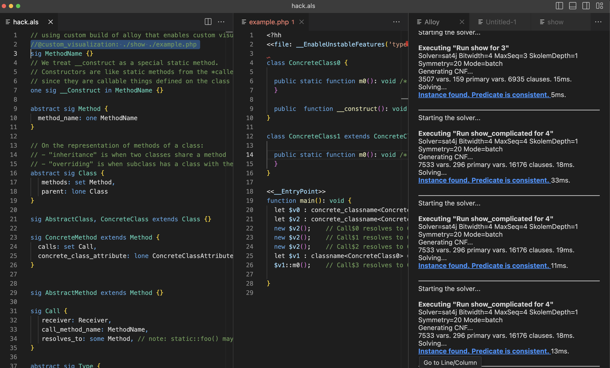

# Alloy modelling for sound late static bindings



This repo models potential Hack language feautures for sound
[Late Static Bindings](https://www.php.net/manual/en/language.oop5.late-static-bindings.php).

You can ask the Alloy model for examples of valid Hack programs and ask it to check safety properties for you.

Here's an example of a generated Hack program:

```
<?hh
<<file: __EnableUnstableFeatures('typed_local_variables')>>

abstract class AbstractClass0 {

  public static abstract function m1(): void /* AbstractMethod$1*/;

  public static function m0(): void /* ConcreteMethod$0*/ {}
}

abstract class AbstractClass1 extends AbstractClass0 {

  public static abstract function m1(): void /* AbstractMethod$2*/;
  // type errors: CantOverrideNonConcreteClassMethodWithConcreteClassMethod

  <<__ConcreteClass>>
  public static function m0(): void /* ConcreteMethod$1*/ {
   // Runtime fatal!
   static::m1();    // Call$0 resolves to AbstractMethod$2
  }
}

<<__EntryPoint>>
function main(): void {
  let $v0 : classname<AbstractClass1> = AbstractClass1::class;
  let $v1 : classname<AbstractClass0> = $v0;
  $v1::m0();    // Call$1 resolves to ConcreteMethod$1

}
```

which can be easier to digest than [a graph representation](./analyzer.png).

Demo: [./demo.mov](./demo.mov)

<video alt="demo" src="./demo.mov"></video>


## How to Run

Use with this custom build of Alloy that understands how to use custom visualizations: [mheiber/org.alloytools.alloy](https://github.com/mheiber/org.alloytools.alloy/). See instructions there, which use the examples from this repo.
